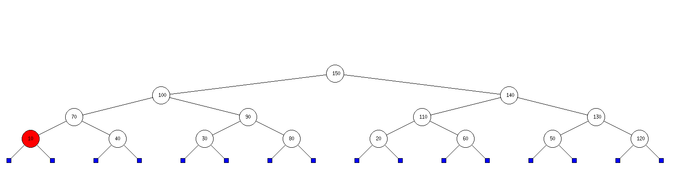

# TreeViewer
A graphical interface to visualize tree operations, made in OCaml.

### __What does it do ?__ 
- It draws tree on an empty canvas, using the official `Graphics` OCaml library. I'm working on a way to parse trees and heaps from a text file.
### __Requirements__ 

- `opam` : necessary to build executable OCaml code.
- [dune](https://github.com/ocaml/dune) : a composable build system for OCaml. Basically, it manages dependencies for us. You can get it through opam (the OCaml Package Manager) with : 
```ps
opam install dune
```
- `Graphics` library : since OCaml 4.06, graphics is not part of the stdlib you get by downloading opam anymore. Install it using : 
```ps
opam install graphics
```

### __Installation__

- Clone the repository wherever you want : 
```ps
git clone https://github.com/Esteban795/TreeViewer.git
```

### __How to use it ?__ 

- After you're done cloning it, head to the directory. There, you can test with the given example if everything is running correctly. First, open a terminal and type 
```ps
eval $(opam env)
```
to make sure dune will be detected. You'll need to type this ***every time*** you start a new terminal, so avoid killing your terminal each time !

- Then, you can just run 
```ps
dune exec ./test/TreeViewer.exe
```
- If everything goes according to plan, you should be able to see something this beautiful max_heap :



### __What's left to do ?__

- Known issue : can't represent big trees, for the simple reason that the screen is static and just can't move.
- Known issue : can't resize without losing the displayed tree. (might have to go the SDL route ?)